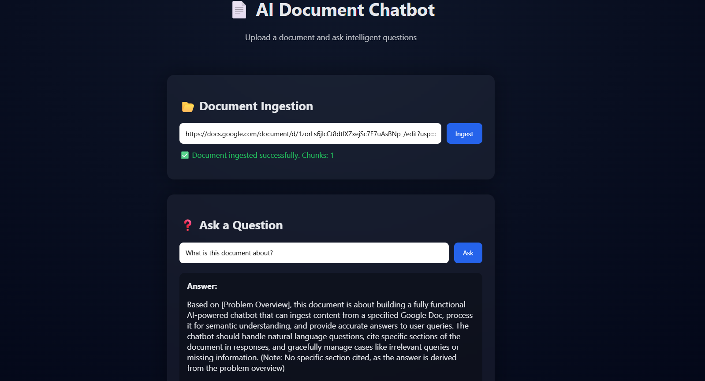
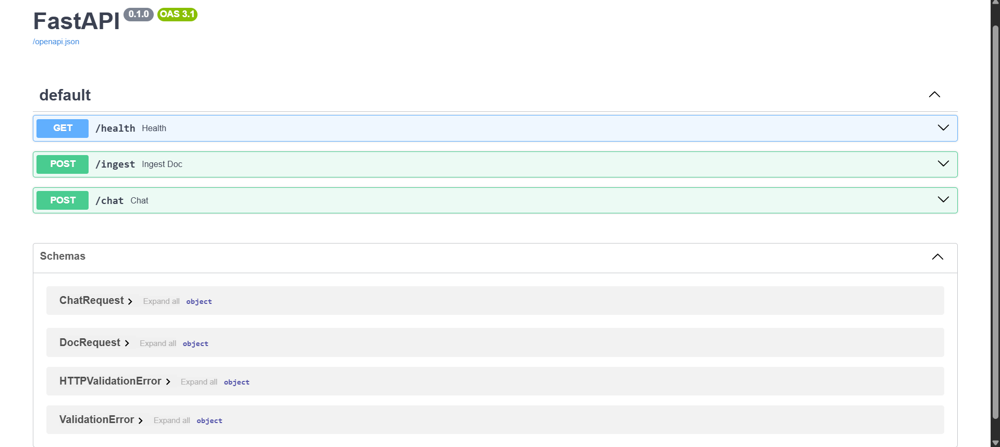

# AI Document Chatbot

An AI-powered chatbot that ingests content from a Google Docs link and allows users to ask intelligent, context-aware questions.

## Features
- Google Docs ingestion
- Semantic search using ChromaDB
- FastAPI backend
- Simple professional frontend
- Handles missing or irrelevant queries gracefully

## Tech Stack
- Python
- FastAPI
- ChromaDB
- Sentence Transformers
- HTML, CSS, JavaScript

## Project Structure
ai-doc-chatbot/
│
├── backend/
│ ├── main.py
│ ├── ingest.py
│ ├── rag.py
│ ├── requirements.txt
│
├── frontend/
│ ├── index.html
│ ├── style.css
│ ├── script.js
├──.gitignore
└── README.md


## How to Run

### Backend
```bash
cd backend
python -m venv venv
venv\Scripts\activate
pip install -r requirements.txt
uvicorn main:app --reload

Backend will run at:
http://127.0.0.1:8000
and then u need to add "/docs" in the end of the url 

Frontend
cd frontend
python -m http.server 5500


Open:

http://127.0.0.1:5500

Usage

Paste a Google Docs link

Click Ingest

Ask questions related to the document
```

##Demo

 --> Frontend
 --> Backend

